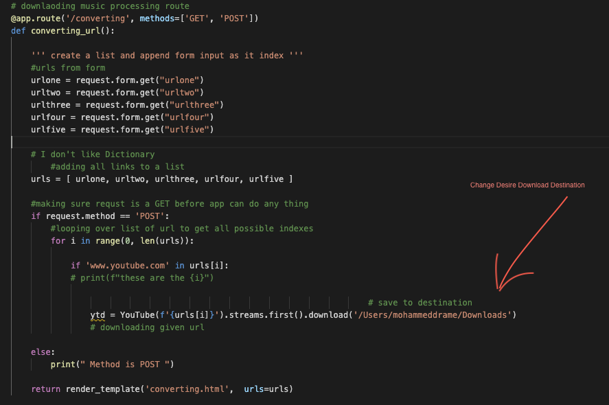

### Builk download is a  reponsive webapp built with flask using python3. It gives user the ultimate power to download up to 5 content from youtube using URLS.


### Url Format : 


 ### Home : 


### Usage :

  * ``` git clone git@github.com:mdrame/bulk_downloader ``` / download zip filder.
  * Check requirements.txt for needed packages. Done? Now open app.py in desire textEditor.
  * Change desire download destination .
  * In the root directory run app using ``` python3 app.py ``` and enjoy.
  * youtube urls only.
  
  * Note: Make sure to deactivate env before running app.
  

## Technology :

  * HTML
  * CSS
  * Flask
  * Python3
  
  
### Open source challange:

  * Add ProgressHub when user hit the Download button so they can see what's going on in the background on the app.
  * Use any webframework of your choice. javascrip, Jquery
  

### Disclaimer :

  * Project is intended for research purposes only!.
  
### Todo :

 * Error Handeling page - Render user to this page if url link is not right.
 * ProgressHud on download


