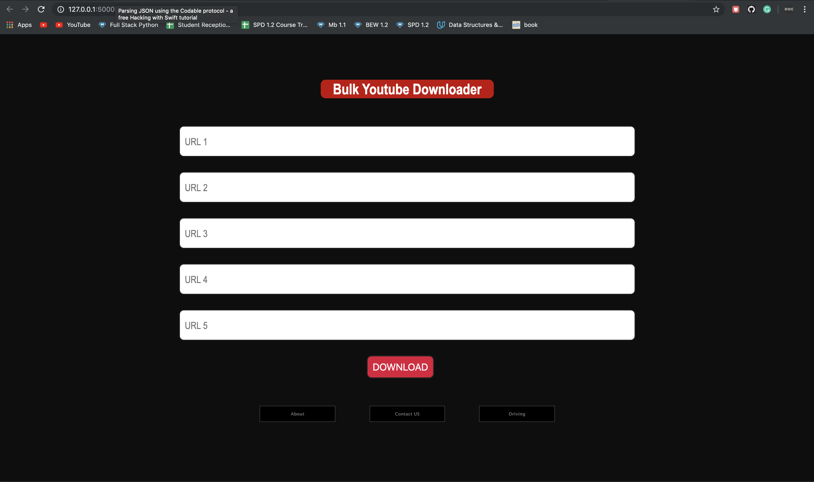

### Build Downloading reponsive app built in python3 that let users to download up to 5 content from youtube using URLS.

## Usage
  
  * coming ..... 

## Technology

* HTML
* CSS
* Flask

## Packages 

* Find packages in requirements.txt

### Disclaimer 

* Project is intended for research purposes only!

#### Todo

* make public  
* add a gif insted of an image
* Error handle code
* Specific Directory location to download file to
